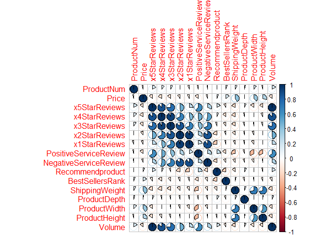
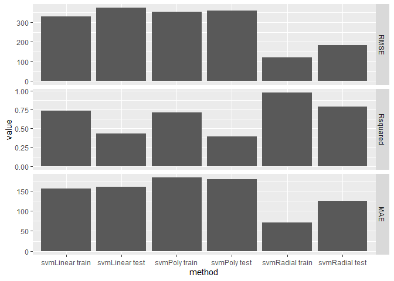

Blackwell ProductType Prediction
================
Gherardo Lattanzi, Edison Guevara
October 23, 2019

# Set working directory

``` r
rm(list = ls()) 
getwd()         
```

    ## [1] "/Users/gherardolattanzi/MultipleReg"

``` r
setwd("/Users/gherardolattanzi/MultipleReg")
existingprod <- read.csv("Data/existingproductattributes2017.csv")
newprod <- read.csv("Data/newproductattributes2017.csv")
```

# Import Libraries

``` r
pacman::p_load(caret, tidyverse, readr, corrplot, caretEnsemble, 
               data.table, e1071)
library(ggplot2)
library(caret)
library(corrplot)
library(dummy)
```

    ## dummy 0.1.3

    ## dummyNews()

current\_path = getActiveDocumentContext()$path
setwd(dirname(current\_path))

\#Check for Missing Values

``` r
any(is.na(newprod)) 
```

    ## [1] FALSE

``` r
any(is.na(existingprod)) 
```

    ## [1] TRUE

``` r
#Lets substitute the missing NA with 
sum(is.na(existingprod["BestSellersRank"]))   
```

    ## [1] 15

``` r
sum(is.na(existingprod))   
```

    ## [1] 15

``` r
existingprod$BestSellersRank[is.na(existingprod$BestSellersRank)] <- mean(existingprod$BestSellersRank, na.rm = TRUE)
```

``` r
existingprod$ProfitMargin <- NULL
```

# Setting Volume as Numeric from Integer for both new and existing products

``` r
existingprod$Volume <- as.numeric(existingprod$Volume)
str(existingprod)
```

    ## 'data.frame':    80 obs. of  17 variables:
    ##  $ ProductType          : Factor w/ 12 levels "Accessories",..: 7 7 7 5 5 1 1 1 1 1 ...
    ##  $ ProductNum           : int  101 102 103 104 105 106 107 108 109 110 ...
    ##  $ Price                : num  949 2250 399 410 1080 ...
    ##  $ x5StarReviews        : int  3 2 3 49 58 83 11 33 16 10 ...
    ##  $ x4StarReviews        : int  3 1 0 19 31 30 3 19 9 1 ...
    ##  $ x3StarReviews        : int  2 0 0 8 11 10 0 12 2 1 ...
    ##  $ x2StarReviews        : int  0 0 0 3 7 9 0 5 0 0 ...
    ##  $ x1StarReviews        : int  0 0 0 9 36 40 1 9 2 0 ...
    ##  $ PositiveServiceReview: int  2 1 1 7 7 12 3 5 2 2 ...
    ##  $ NegativeServiceReview: int  0 0 0 8 20 5 0 3 1 0 ...
    ##  $ Recommendproduct     : num  0.9 0.9 0.9 0.8 0.7 0.3 0.9 0.7 0.8 0.9 ...
    ##  $ BestSellersRank      : num  1967 4806 12076 109 268 ...
    ##  $ ShippingWeight       : num  25.8 50 17.4 5.7 7 1.6 7.3 12 1.8 0.75 ...
    ##  $ ProductDepth         : num  23.9 35 10.5 15 12.9 ...
    ##  $ ProductWidth         : num  6.62 31.75 8.3 9.9 0.3 ...
    ##  $ ProductHeight        : num  16.9 19 10.2 1.3 8.9 ...
    ##  $ Volume               : num  12 8 12 196 232 332 44 132 64 40 ...

``` r
newprod$Volume <- as.numeric(newprod$Volume)
str(newprod)
```

    ## 'data.frame':    24 obs. of  18 variables:
    ##  $ ProductType          : Factor w/ 12 levels "Accessories",..: 7 7 5 5 5 6 6 6 6 12 ...
    ##  $ ProductNum           : int  171 172 173 175 176 178 180 181 183 186 ...
    ##  $ Price                : num  699 860 1199 1199 1999 ...
    ##  $ x5StarReviews        : int  96 51 74 7 1 19 312 23 3 296 ...
    ##  $ x4StarReviews        : int  26 11 10 2 1 8 112 18 4 66 ...
    ##  $ x3StarReviews        : int  14 10 3 1 1 4 28 7 0 30 ...
    ##  $ x2StarReviews        : int  14 10 3 1 3 1 31 22 1 21 ...
    ##  $ x1StarReviews        : int  25 21 11 1 0 10 47 18 0 36 ...
    ##  $ PositiveServiceReview: int  12 7 11 2 0 2 28 5 1 28 ...
    ##  $ NegativeServiceReview: int  3 5 5 1 1 4 16 16 0 9 ...
    ##  $ Recommendproduct     : num  0.7 0.6 0.8 0.6 0.3 0.6 0.7 0.4 0.7 0.8 ...
    ##  $ BestSellersRank      : int  2498 490 111 4446 2820 4140 2699 1704 5128 34 ...
    ##  $ ShippingWeight       : num  19.9 27 6.6 13 11.6 5.8 4.6 4.8 4.3 3 ...
    ##  $ ProductDepth         : num  20.63 21.89 8.94 16.3 16.81 ...
    ##  $ ProductWidth         : num  19.2 27 12.8 10.8 10.9 ...
    ##  $ ProductHeight        : num  8.39 9.13 0.68 1.4 0.88 1.2 0.95 1.5 0.97 0.37 ...
    ##  $ ProfitMargin         : num  0.25 0.2 0.1 0.15 0.23 0.08 0.09 0.11 0.09 0.1 ...
    ##  $ Volume               : num  0 0 0 0 0 0 0 0 0 0 ...

# dummify the data

``` r
dummy_matrix <- dummyVars("~ .", data = existingprod)
str(dummy_matrix)
```

    ## List of 9
    ##  $ call      : language dummyVars.default(formula = "~ .", data = existingprod)
    ##  $ form      :Class 'formula'  language ~.
    ##   .. ..- attr(*, ".Environment")=<environment: 0x7f7fdd9b7bb8> 
    ##  $ vars      : chr [1:17] "ProductType" "ProductNum" "Price" "x5StarReviews" ...
    ##  $ facVars   : chr "ProductType"
    ##  $ lvls      :List of 1
    ##   ..$ ProductType: chr [1:12] "Accessories" "Display" "ExtendedWarranty" "GameConsole" ...
    ##  $ sep       : chr "."
    ##  $ terms     :Classes 'terms', 'formula'  language ~ProductType + ProductNum + Price + x5StarReviews + x4StarReviews +      x3StarReviews + x2StarReviews + x1StarRe| __truncated__ ...
    ##   .. ..- attr(*, "variables")= language list(ProductType, ProductNum, Price, x5StarReviews, x4StarReviews,      x3StarReviews, x2StarReviews, x1StarRevie| __truncated__ ...
    ##   .. ..- attr(*, "factors")= int [1:17, 1:17] 1 0 0 0 0 0 0 0 0 0 ...
    ##   .. .. ..- attr(*, "dimnames")=List of 2
    ##   .. .. .. ..$ : chr [1:17] "ProductType" "ProductNum" "Price" "x5StarReviews" ...
    ##   .. .. .. ..$ : chr [1:17] "ProductType" "ProductNum" "Price" "x5StarReviews" ...
    ##   .. ..- attr(*, "term.labels")= chr [1:17] "ProductType" "ProductNum" "Price" "x5StarReviews" ...
    ##   .. ..- attr(*, "order")= int [1:17] 1 1 1 1 1 1 1 1 1 1 ...
    ##   .. ..- attr(*, "intercept")= int 1
    ##   .. ..- attr(*, "response")= int 0
    ##   .. ..- attr(*, ".Environment")=<environment: 0x7f7fdd9b7bb8> 
    ##   .. ..- attr(*, "predvars")= language list(ProductType, ProductNum, Price, x5StarReviews, x4StarReviews,      x3StarReviews, x2StarReviews, x1StarRevie| __truncated__ ...
    ##   .. ..- attr(*, "dataClasses")= Named chr [1:17] "factor" "numeric" "numeric" "numeric" ...
    ##   .. .. ..- attr(*, "names")= chr [1:17] "ProductType" "ProductNum" "Price" "x5StarReviews" ...
    ##  $ levelsOnly: logi FALSE
    ##  $ fullRank  : logi FALSE
    ##  - attr(*, "class")= chr "dummyVars"

``` r
existingprod_dum <- data.frame(predict(dummy_matrix, newdata = existingprod))
```

# correlation matrix to spot relationships

``` r
cor_existingprod_dum <- cor(existingprod_dum)

cor_existingprod <- cor(select(existingprod,-ProductType))

corrplot(cor_existingprod_dum, tl.cex = 0.6, method = "pie")
```

<!-- -->

``` r
corrplot(cor_existingprod, method = "pie")
```

<!-- -->

existingprod\(x5StarReviews <- NULL existingprod\)x1StarReviews \<- NULL
existingprod\(x3StarReviews <- NULL existingprod\)NegativeServiceReview
\<-
NULL

# correlation matrix to spot relationships for new products

``` r
correlationsnew <- cor(newprod[,c(3,4,5,6,7,8,9,10,11,12,13,14,15,16,17)])
corrplot(correlationsnew, method = "pie") 
```

<!-- -->

``` r
print(correlationsnew)
```

    ##                             Price x5StarReviews x4StarReviews
    ## Price                  1.00000000   -0.07382754   -0.11087286
    ## x5StarReviews         -0.07382754    1.00000000    0.86156376
    ## x4StarReviews         -0.11087286    0.86156376    1.00000000
    ## x3StarReviews         -0.12041714    0.78144956    0.97642080
    ## x2StarReviews         -0.12040317    0.71083333    0.95261395
    ## x1StarReviews         -0.14594298    0.61377988    0.91396774
    ## PositiveServiceReview -0.08727618    0.88571578    0.98200009
    ## NegativeServiceReview -0.07549193    0.66453818    0.80016317
    ## Recommendproduct      -0.33546797    0.38626309    0.31062215
    ## BestSellersRank       -0.06406564   -0.14310283   -0.12340182
    ## ShippingWeight         0.30538172    0.14592069   -0.02366589
    ## ProductDepth           0.55440604   -0.11059532   -0.15395982
    ## ProductWidth           0.29976211   -0.15108379   -0.16341943
    ## ProductHeight         -0.08322197   -0.03516902   -0.10534722
    ## ProfitMargin          -0.03966504   -0.03045462   -0.04346523
    ##                       x3StarReviews x2StarReviews x1StarReviews
    ## Price                   -0.12041714  -0.120403166   -0.14594298
    ## x5StarReviews            0.78144956   0.710833335    0.61377988
    ## x4StarReviews            0.97642080   0.952613948    0.91396774
    ## x3StarReviews            1.00000000   0.984789621    0.95019130
    ## x2StarReviews            0.98478962   1.000000000    0.97101543
    ## x1StarReviews            0.95019130   0.971015430    1.00000000
    ## PositiveServiceReview    0.94939773   0.922510464    0.89358039
    ## NegativeServiceReview    0.75033197   0.806746949    0.77958203
    ## Recommendproduct         0.26292639   0.172124249    0.17167279
    ## BestSellersRank         -0.06364895   0.004361332   -0.03969621
    ## ShippingWeight          -0.05810772  -0.104655234   -0.14209324
    ## ProductDepth            -0.16836843  -0.190425489   -0.19535813
    ## ProductWidth            -0.15862034  -0.169516140   -0.12340531
    ## ProductHeight           -0.13693604  -0.165810554   -0.10670193
    ## ProfitMargin            -0.03102536  -0.060938012   -0.07758165
    ##                       PositiveServiceReview NegativeServiceReview
    ## Price                          -0.087276184         -0.0754919276
    ## x5StarReviews                   0.885715784          0.6645381774
    ## x4StarReviews                   0.982000086          0.8001631738
    ## x3StarReviews                   0.949397729          0.7503319690
    ## x2StarReviews                   0.922510464          0.8067469492
    ## x1StarReviews                   0.893580388          0.7795820270
    ## PositiveServiceReview           1.000000000          0.8196544641
    ## NegativeServiceReview           0.819654464          1.0000000000
    ## Recommendproduct                0.360831992          0.0539570729
    ## BestSellersRank                -0.134995058         -0.0009529939
    ## ShippingWeight                  0.007449719         -0.1073175650
    ## ProductDepth                   -0.141295323         -0.2155576801
    ## ProductWidth                   -0.123905533         -0.1382365188
    ## ProductHeight                  -0.067617496         -0.1463361480
    ## ProfitMargin                   -0.065353674         -0.1892907418
    ##                       Recommendproduct BestSellersRank ShippingWeight
    ## Price                      -0.33546797   -0.0640656369    0.305381720
    ## x5StarReviews               0.38626309   -0.1431028328    0.145920693
    ## x4StarReviews               0.31062215   -0.1234018174   -0.023665887
    ## x3StarReviews               0.26292639   -0.0636489532   -0.058107720
    ## x2StarReviews               0.17212425    0.0043613320   -0.104655234
    ## x1StarReviews               0.17167279   -0.0396962079   -0.142093238
    ## PositiveServiceReview       0.36083199   -0.1349950580    0.007449719
    ## NegativeServiceReview       0.05395707   -0.0009529939   -0.107317565
    ## Recommendproduct            1.00000000   -0.1542109832    0.110798147
    ## BestSellersRank            -0.15421098    1.0000000000   -0.203358073
    ## ShippingWeight              0.11079815   -0.2033580728    1.000000000
    ## ProductDepth                0.01437657   -0.2917761162    0.756791718
    ## ProductWidth                0.09762164   -0.2473962751    0.770927807
    ## ProductHeight               0.26833286   -0.1949204105    0.795171973
    ## ProfitMargin                0.08156030   -0.1473475029    0.666513549
    ##                       ProductDepth ProductWidth ProductHeight ProfitMargin
    ## Price                   0.55440604   0.29976211   -0.08322197  -0.03966504
    ## x5StarReviews          -0.11059532  -0.15108379   -0.03516902  -0.03045462
    ## x4StarReviews          -0.15395982  -0.16341943   -0.10534722  -0.04346523
    ## x3StarReviews          -0.16836843  -0.15862034   -0.13693604  -0.03102536
    ## x2StarReviews          -0.19042549  -0.16951614   -0.16581055  -0.06093801
    ## x1StarReviews          -0.19535813  -0.12340531   -0.10670193  -0.07758165
    ## PositiveServiceReview  -0.14129532  -0.12390553   -0.06761750  -0.06535367
    ## NegativeServiceReview  -0.21555768  -0.13823652   -0.14633615  -0.18929074
    ## Recommendproduct        0.01437657   0.09762164    0.26833286   0.08156030
    ## BestSellersRank        -0.29177612  -0.24739628   -0.19492041  -0.14734750
    ## ShippingWeight          0.75679172   0.77092781    0.79517197   0.66651355
    ## ProductDepth            1.00000000   0.85162710    0.48615456   0.25216276
    ## ProductWidth            0.85162710   1.00000000    0.67409332   0.27358454
    ## ProductHeight           0.48615456   0.67409332    1.00000000   0.72202181
    ## ProfitMargin            0.25216276   0.27358454    0.72202181   1.00000000

# Boxplot to identify outliers

``` r
ggplot(existingprod, aes(x = ProductType, y = Volume, 
                              fill = ProductType)) + 
  geom_boxplot() + 
  stat_summary(fun.y = median, color = "white", geom = "text",
               vjust = -0.7, 
               aes(label = round(..y.., digits = 1)))
```

<!-- -->

``` r
ggplot(existingprod, aes(x=0, y=Volume)) + 
  geom_boxplot() + 
  stat_summary(fun.y = median, color = "white", geom = "text",
               vjust = -0.7, 
               aes(label = round(..y.., digits = 1)))
```

<!-- -->

# Removing outliers

``` r
summary(!existingprod$Volume > 6000)
```

    ##    Mode   FALSE    TRUE 
    ## logical       2      78

``` r
existingprod <- existingprod[!(existingprod$Volume > 6000),]
```

# Scatter plots

``` r
ggplot(existingprod, aes(x= x4StarReviews, y= Volume)) +
  geom_point()
```

<!-- -->

``` r
ggplot(existingprod_dum, aes(x = ProductType.PC, y = Volume)) +
  geom_point()
```

<!-- -->

# Histograms to look at the distributions

``` r
ggplot(existingprod, aes(x = x4StarReviews, fill = ProductType)) + 
  geom_histogram(binwidth = 10, 
                 color = "white") + 
  ggtitle("Histogram Existing Products - 4 Star Reviews")
```

<!-- -->

``` r
ggplot(newprod, aes(x = x4StarReviews, fill = ProductType)) + 
  geom_histogram(binwidth = 10, 
                 color = "white") + 
  ggtitle("Histogram New Products - 4 Star Reviews")
```

<!-- -->

``` r
ggplot(existingprod, aes(x = x2StarReviews, fill = ProductType)) + 
  geom_histogram(binwidth = 10, 
                 color = "white") + 
  ggtitle("Histogram Existing Products - 2 Star Reviews")
```

<!-- -->

``` r
ggplot(newprod, aes(x = x2StarReviews, fill = ProductType)) + 
  geom_histogram(binwidth = 10, 
                 color = "white") + 
  ggtitle("Histogram New Products - 2 Star Reviews")
```

<!-- -->

``` r
ggplot(existingprod, aes(x = PositiveServiceReview, fill = ProductType)) + 
  geom_histogram(binwidth = 10, 
                 color = "white") + 
  ggtitle("Histogram Existing Products - Positive Service Reviews")
```

<!-- -->

``` r
ggplot(newprod, aes(x = PositiveServiceReview, fill = ProductType)) + 
  geom_histogram(binwidth = 10, 
                 color = "white") + 
  ggtitle("Histogram New Products - Positive Service Reviews")
```

<!-- -->

``` r
ggplot(existingprod, aes(x = Volume, fill = ProductType)) + 
  geom_histogram(binwidth = 100, 
                 color = "white") + 
  ggtitle("Histogram Existing Products - Volume")
```

<!-- -->
As we can see, there is a similar distribution among the new and
exsinting products, and therefore we can trust our trained existing
models to be applied in predicting new product Sales Volume.

# Analysis of variance (ANOVA)

``` r
set.seed(111)
anova_results <- aov(Volume ~ ProductType, data = existingprod)
summary(anova_results)
```

    ##             Df   Sum Sq Mean Sq F value Pr(>F)  
    ## ProductType 11  7924587  720417   2.392 0.0146 *
    ## Residuals   66 19881311  301232                 
    ## ---
    ## Signif. codes:  0 '***' 0.001 '**' 0.01 '*' 0.05 '.' 0.1 ' ' 1

P - value = .0961 – This is not significant result. It is not possible
to reject the null hypothesis (product type has no influence). Hence,
probably product type don’t have influence.

# Define an 75%/25% train/test split

``` r
set.seed(98)
trainSize <- createDataPartition(y=existingprod$Volume, p = .75, list = F)
trainSet <- existingprod[trainSize,]
testSet <- existingprod[-trainSize,]
```

# SVM selection

``` r
#  Looking at different kernels of SVM

fit <- c()
prediction <- c()
performance <- c()
error_test_compare  <- c()
error_overfit_compare <- c()


models <- c("svmLinear", "svmPoly", "svmRadial")
ctrl <- trainControl(method = "repeatedcv", number = 10, repeats = 1)

for (j in 21:21){
  set.seed(j)
  for (i in models){
    fit <- train(Volume ~ x4StarReviews + x2StarReviews + 
                   PositiveServiceReview , 
                 data = trainSet, 
                 method = i,
                 tuneLength = 3,
                 trControl = ctrl,
                 preProc = c("center", "scale"))
    prediction_test <- predict(fit, newdata = testSet)
    prediction_train <- predict(fit, newdate = trainSet)
    
    performance_test <- postResample(prediction_test, testSet$Volume)
    performance_train <- postResample(prediction_train, trainSet$Volume)

    error_test_compare <- cbind(error_test_compare, performance_test)
    error_overfit_compare <- cbind(error_overfit_compare, 
                                   performance_train, 
                                   performance_test)
}
}

colnames(error_overfit_compare) <- c("svmLinear train", "svmLinear test", "svmPoly train", "svmPoly test", "svmRadial train", "svmRadial test")
colnames(error_test_compare) <- models

summary(existingprod)
```

    ##            ProductType   ProductNum        Price         x5StarReviews  
    ##  Accessories     :25   Min.   :101.0   Min.   :   3.60   Min.   :  0.0  
    ##  Printer         :12   1st Qu.:120.2   1st Qu.:  53.79   1st Qu.: 10.0  
    ##  ExtendedWarranty:10   Median :139.5   Median : 134.03   Median : 41.5  
    ##  Software        : 6   Mean   :141.7   Mean   : 251.30   Mean   :122.3  
    ##  Display         : 5   3rd Qu.:159.8   3rd Qu.: 357.49   3rd Qu.:221.8  
    ##  PC              : 4   Max.   :200.0   Max.   :2249.99   Max.   :535.0  
    ##  (Other)         :16                                                    
    ##  x4StarReviews    x3StarReviews    x2StarReviews    x1StarReviews    
    ##  Min.   :  0.00   Min.   :  0.00   Min.   :  0.00   Min.   :   0.00  
    ##  1st Qu.:  2.25   1st Qu.:  2.00   1st Qu.:  1.00   1st Qu.:   2.00  
    ##  Median : 19.00   Median :  6.50   Median :  3.00   Median :   8.00  
    ##  Mean   : 31.91   Mean   : 11.76   Mean   : 11.45   Mean   :  34.62  
    ##  3rd Qu.: 32.50   3rd Qu.: 10.00   3rd Qu.:  7.00   3rd Qu.:  15.00  
    ##  Max.   :261.00   Max.   :162.00   Max.   :370.00   Max.   :1654.00  
    ##                                                                      
    ##  PositiveServiceReview NegativeServiceReview Recommendproduct
    ##  Min.   :  0.00        Min.   :  0.000       Min.   :0.1000  
    ##  1st Qu.:  2.00        1st Qu.:  1.000       1st Qu.:0.7000  
    ##  Median :  5.00        Median :  2.500       Median :0.8000  
    ##  Mean   : 45.49        Mean   :  5.936       Mean   :0.7423  
    ##  3rd Qu.: 27.25        3rd Qu.:  5.750       3rd Qu.:0.9000  
    ##  Max.   :310.00        Max.   :112.000       Max.   :1.0000  
    ##                                                              
    ##  BestSellersRank    ShippingWeight    ProductDepth      ProductWidth   
    ##  Min.   :    1.00   Min.   : 0.010   Min.   :  0.000   Min.   : 0.000  
    ##  1st Qu.:    8.25   1st Qu.: 0.550   1st Qu.:  4.725   1st Qu.: 1.650  
    ##  Median :   72.50   Median : 2.100   Median :  7.950   Median : 6.950  
    ##  Mean   : 1152.05   Mean   : 9.818   Mean   : 14.596   Mean   : 7.885  
    ##  3rd Qu.: 1126.31   3rd Qu.:11.735   3rd Qu.: 15.075   3rd Qu.:11.425  
    ##  Max.   :17502.00   Max.   :63.000   Max.   :300.000   Max.   :31.750  
    ##                                                                        
    ##  ProductHeight        Volume      
    ##  Min.   : 0.000   Min.   :   0.0  
    ##  1st Qu.: 0.400   1st Qu.:  40.0  
    ##  Median : 4.700   Median : 166.0  
    ##  Mean   : 6.381   Mean   : 489.2  
    ##  3rd Qu.:10.500   3rd Qu.: 887.0  
    ##  Max.   :25.800   Max.   :2140.0  
    ## 

``` r
# Mean sales volume (with oultiers) is 705 and median 200
# Mean sales volume (without outliers) is 489 and median 166


error_overfit_compare_melt <- melt(error_overfit_compare)
```

    ## Warning in melt(error_overfit_compare): The melt generic in data.table has
    ## been passed a matrix and will attempt to redirect to the relevant reshape2
    ## method; please note that reshape2 is deprecated, and this redirection is
    ## now deprecated as well. To continue using melt methods from reshape2 while
    ## both libraries are attached, e.g. melt.list, you can prepend the namespace
    ## like reshape2::melt(error_overfit_compare). In the next version, this
    ## warning will become an error.

``` r
print(error_overfit_compare_melt)
```

    ##        Var1            Var2       value
    ## 1      RMSE svmLinear train 356.6585662
    ## 2  Rsquared svmLinear train   0.6863776
    ## 3       MAE svmLinear train 165.5781480
    ## 4      RMSE  svmLinear test 157.4665276
    ## 5  Rsquared  svmLinear test   0.9103027
    ## 6       MAE  svmLinear test  88.6066183
    ## 7      RMSE   svmPoly train 359.8106735
    ## 8  Rsquared   svmPoly train   0.6806089
    ## 9       MAE   svmPoly train 174.9388199
    ## 10     RMSE    svmPoly test 160.9684129
    ## 11 Rsquared    svmPoly test   0.9038879
    ## 12      MAE    svmPoly test  95.8305397
    ## 13     RMSE svmRadial train 149.3352066
    ## 14 Rsquared svmRadial train   0.9688030
    ## 15      MAE svmRadial train  82.7972511
    ## 16     RMSE  svmRadial test 140.8555728
    ## 17 Rsquared  svmRadial test   0.9393448
    ## 18      MAE  svmRadial test 104.5836330

``` r
colnames(error_overfit_compare_melt) <- c("metric","method","value")
ggplot(error_overfit_compare_melt, aes(y = value, x = method)) + 
  geom_bar(stat = "identity") +
  facet_grid(metric ~. , scale = "free")
```

<!-- -->

SVMRadial has the lowest RMSE and best R2. Therefore is the SVM model to
be selected.

# for loop to compare different models

``` r
fit <- c()
prediction <- c()
performance <- c()
error_test_compare  <- c()
error_overfit_compare <- c()
models <- c("lm", "knn", "svmRadial", "rf")
ctrl <- trainControl(method = "repeatedcv", number = 10, repeats = 1)
for (j in 1:3){
  set.seed(j)
  trainSize <- createDataPartition(y=existingprod$Volume, 
                                   p = .75, 
                                   list = F)
  trainSet <- existingprod[trainSize,]
  testSet <- existingprod[-trainSize,]
  for (i in models){
    fit <- train(Volume ~ x4StarReviews + x2StarReviews + 
                   PositiveServiceReview , 
                 data = trainSet, 
                 method = i,
                 tuneLength = 3,
                 trControl = ctrl,
                 preProc = c("center", "scale"))
    prediction_test <- predict(fit, newdata = testSet)
    prediction_train <- predict(fit, newdate = trainSet)
    
    performance_test <- postResample(prediction_test, testSet$Volume)
    performance_train <- postResample(prediction_train, trainSet$Volume)
    
    error_test_compare <- cbind(error_test_compare, performance_test)
    error_overfit_compare <- cbind(error_overfit_compare, 
                                   performance_train, 
                                   performance_test)
  }
  
}
```

    ## note: only 2 unique complexity parameters in default grid. Truncating the grid to 2 .
    ## 
    ## note: only 2 unique complexity parameters in default grid. Truncating the grid to 2 .
    ## 
    ## note: only 2 unique complexity parameters in default grid. Truncating the grid to 2 .

``` r
colnames(error_overfit_compare) <- c("lm train", "lm test", 
                                     "knn train", "knn test", 
                                     "svmRadial train", 
                                     "svmRadial test", "rf train", 
                                     "rf test", "lm train", "lm test", 
                                     "knn train", "knn test", 
                                     "svmRadial train", 
                                     "svmRadial test", "rf train", 
                                     "rf test", "lm train", "lm test", 
                                     "knn train", "knn test", 
                                     "svmRadial train", 
                                     "svmRadial test", "rf train", 
                                     "rf test")
colnames(error_test_compare) <- c("lm", "knn", "svmRadial", "rf",
                                  "lm", "knn", "svmRadial", "rf",
                                  "lm", "knn", "svmRadial", "rf")
# Plotting
error_test_compare_melt <- melt(error_test_compare)
```

    ## Warning in melt(error_test_compare): The melt generic in data.table has
    ## been passed a matrix and will attempt to redirect to the relevant reshape2
    ## method; please note that reshape2 is deprecated, and this redirection is
    ## now deprecated as well. To continue using melt methods from reshape2 while
    ## both libraries are attached, e.g. melt.list, you can prepend the namespace
    ## like reshape2::melt(error_test_compare). In the next version, this warning
    ## will become an error.

``` r
colnames(error_test_compare_melt) <- c("metric", "method", "value")
error_test_compare_melt$seed[1:12] <- 1
error_test_compare_melt$seed[13:24] <- 2
error_test_compare_melt$seed[25:36] <- 3
# Overfit comparison
error_overfit_compare_melt <- melt(error_overfit_compare)
```

    ## Warning in melt(error_overfit_compare): The melt generic in data.table has
    ## been passed a matrix and will attempt to redirect to the relevant reshape2
    ## method; please note that reshape2 is deprecated, and this redirection is
    ## now deprecated as well. To continue using melt methods from reshape2 while
    ## both libraries are attached, e.g. melt.list, you can prepend the namespace
    ## like reshape2::melt(error_overfit_compare). In the next version, this
    ## warning will become an error.

``` r
colnames(error_overfit_compare_melt) <- c("metric", "method", "value")
error_overfit_compare_melt$sample[
  (error_overfit_compare_melt$method == "lm train"|
    error_overfit_compare_melt$method == "knn train"|
    error_overfit_compare_melt$method == "svmRadial train"|
    error_overfit_compare_melt$method == "rf train")] <- "train"
error_overfit_compare_melt$sample[
  (error_overfit_compare_melt$method == "lm test"|
     error_overfit_compare_melt$method == "knn test"|
     error_overfit_compare_melt$method == "svmRadial test"|
     error_overfit_compare_melt$method == "rf test")] <- "test"
error_overfit_compare_melt$method <- as.character(error_overfit_compare_melt$method)
error_overfit_compare_melt$method[
  (error_overfit_compare_melt$method == "lm test" |
     error_overfit_compare_melt$method == "lm train")] <- "lm"
error_overfit_compare_melt$method[
  (error_overfit_compare_melt$method == "knn test" |
     error_overfit_compare_melt$method == "knn train")] <- "knn"
error_overfit_compare_melt$method[
  (error_overfit_compare_melt$method == "svmRadial test" |
     error_overfit_compare_melt$method == "svmRadial train")] <- "svmRadial"
error_overfit_compare_melt$method[
  (error_overfit_compare_melt$method == "rf test" |
     error_overfit_compare_melt$method == "rf train")] <- "rf"
error_overfit_compare_melt$seed[1:24] <- 1
error_overfit_compare_melt$seed[25:48] <- 2
error_overfit_compare_melt$seed[49:72] <- 3
ggplot(error_overfit_compare_melt, aes(y = value, x = method, 
                                       fill = sample)) + 
  geom_bar(stat = "identity", position = "dodge") +
  facet_grid(metric ~ seed, scale = "free")
```

<!-- -->

``` r
ggplot(error_test_compare_melt, aes(y = value, x = method)) + 
  geom_bar(stat = "identity") +
  facet_grid(metric ~ seed, scale = "free")
```

<!-- -->

``` r
# The model selected is Random Forest
# Tunning Random Forest
```

Observing the errors of 4 algorithm, we can see how the Random Forest
both in testing and training sets return the lowest Errors in 3
different resampling scenario (3 different seeds).

\#x4StarReviews x2StarReviews PositiveServiceReview \#Recommendproduct
ShippingWeight Price

``` r
fit <- c()
prediction <- c()
performance <- c()
error_test_compare  <- c()
error_overfit_compare <- c()

models <- c("lm", "knn", "svmRadial", "rf")
ctrl <- trainControl(method = "repeatedcv", number = 10, repeats = 1)

for (j in 1:1){
  set.seed(j)
  for (i in models){
    fit <- train(Volume ~ x4StarReviews + x2StarReviews + 
                   PositiveServiceReview + Recommendproduct + ShippingWeight + Price,
                 data = trainSet, 
                 method = i,
                 tuneLength = 3,
                 trControl = ctrl,
                 preProc = c("center", "scale"))
    prediction_test <- predict(fit, newdata = testSet)
    prediction_train <- predict(fit, newdate = trainSet)
    
    performance_test <- postResample(prediction_test, testSet$Volume)
    performance_train <- postResample(prediction_train, trainSet$Volume)
    
    error_test_compare <- cbind(error_test_compare, performance_test)
    error_overfit_compare <- cbind(error_overfit_compare, 
                                   performance_train, 
                                   performance_test)
  }
}

colnames(error_overfit_compare) <- c("lm train", "lm test", "knn train", "knn test", "svmRadial train", "svmRadial test", "rf train", "rf test")
colnames(error_test_compare) <- models


# Plotting

compare_melt <- melt(error_overfit_compare)
```

    ## Warning in melt(error_overfit_compare): The melt generic in data.table has
    ## been passed a matrix and will attempt to redirect to the relevant reshape2
    ## method; please note that reshape2 is deprecated, and this redirection is
    ## now deprecated as well. To continue using melt methods from reshape2 while
    ## both libraries are attached, e.g. melt.list, you can prepend the namespace
    ## like reshape2::melt(error_overfit_compare). In the next version, this
    ## warning will become an error.

``` r
compare_melt
```

    ##        Var1            Var2       value
    ## 1      RMSE        lm train 329.7509604
    ## 2  Rsquared        lm train   0.6638603
    ## 3       MAE        lm train 213.1356637
    ## 4      RMSE         lm test 503.4943681
    ## 5  Rsquared         lm test   0.8635205
    ## 6       MAE         lm test 277.3576463
    ## 7      RMSE       knn train 290.1659863
    ## 8  Rsquared       knn train   0.7477600
    ## 9       MAE       knn train 171.9851852
    ## 10     RMSE        knn test 373.3198410
    ## 11 Rsquared        knn test   0.7431043
    ## 12      MAE        knn test 217.6296296
    ## 13     RMSE svmRadial train 204.2766284
    ## 14 Rsquared svmRadial train   0.9040292
    ## 15      MAE svmRadial train 101.3334820
    ## 16     RMSE  svmRadial test 542.2844228
    ## 17 Rsquared  svmRadial test   0.4220800
    ## 18      MAE  svmRadial test 267.1384730
    ## 19     RMSE        rf train  82.4107493
    ## 20 Rsquared        rf train   0.9793695
    ## 21      MAE        rf train  40.9383733
    ## 22     RMSE         rf test 343.2787522
    ## 23 Rsquared         rf test   0.8551628
    ## 24      MAE         rf test 162.5374074

``` r
ggplot(compare_melt, aes(y = value, x = Var2)) + 
  geom_bar(stat = "identity") +
  facet_grid(Var1 ~ . , scale = "free")
```

<!-- -->

# Model choice and prediction

``` r
ctrl <- trainControl(method = "repeatedcv", number = 10, repeats = 3)

fit <- train(Volume ~ x4StarReviews + x2StarReviews + 
                   PositiveServiceReview , 
                 data = existingprod, 
                 method = "rf",
                 tuneLength = 10,
                 trControl = ctrl,
                 preProc = c("center", "scale"))
```

    ## note: only 2 unique complexity parameters in default grid. Truncating the grid to 2 .

``` r
finalpredictedvolume <- predict(fit, newdata = newprod)

newprod$finalpredictedvolume <- finalpredictedvolume
print(finalpredictedvolume)
```

    ##           1           2           3           4           5           6 
    ##  494.556000  124.636800  150.840133   36.944667   24.622267   56.380800 
    ##           7           8           9          10          11          12 
    ## 1248.964533  122.626400   24.584400 1275.266800 1903.802133  443.742533 
    ##          13          14          15          16          17          18 
    ##  653.869733   86.656267  161.508133 1354.687200   18.541622   28.805933 
    ##          19          20          21          22          23          24 
    ##   64.262800  115.217067   81.591733   18.541622    4.157867 1604.865333

``` r
  ggplot(newprod, aes(y = finalpredictedvolume, x = ProductType)) + 
  geom_bar(stat = "identity") 
```

<!-- -->

``` r
sum(newprod$finalpredictedvolume[(newprod$ProductType == "PC")])
```

    ## [1] 619.1928

``` r
sum(newprod$finalpredictedvolume[(newprod$ProductType == "Netbook")])
```

    ## [1] 1452.556

``` r
sum(newprod$finalpredictedvolume[(newprod$ProductType == "Laptop")])
```

    ## [1] 212.4071

``` r
sum(newprod$finalpredictedvolume[(newprod$ProductType == "Smartphone")])
```

    ## [1] 1345.777

Netbook and Smartphone are the Products with the highest predicted
selling volumes. However, since there is no relationship between the
product type and its volume (as ANOVA test showed us), this high volume
selling items can be rather explained because of positive service and
customer reviews.
